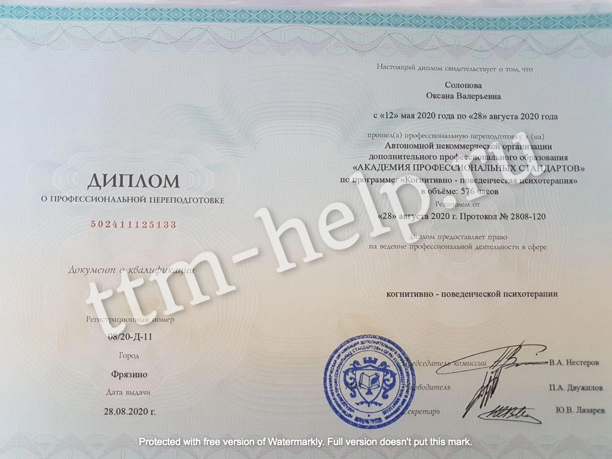
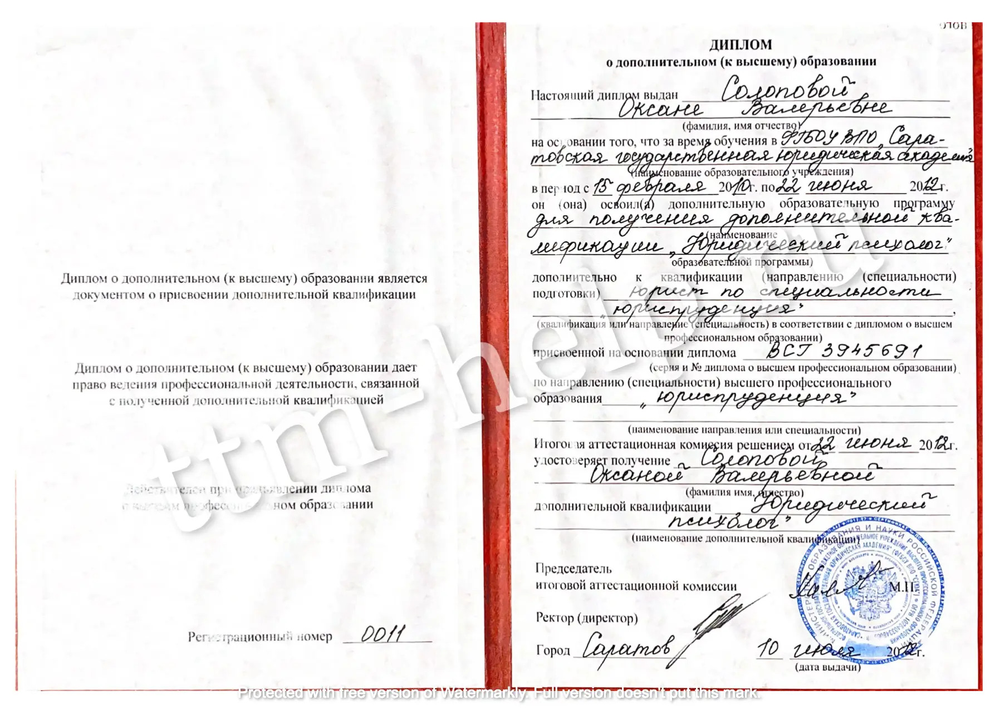
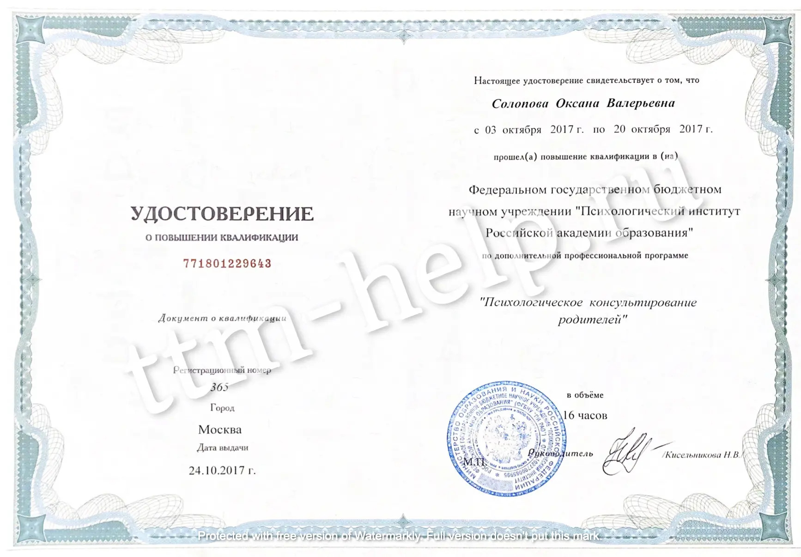
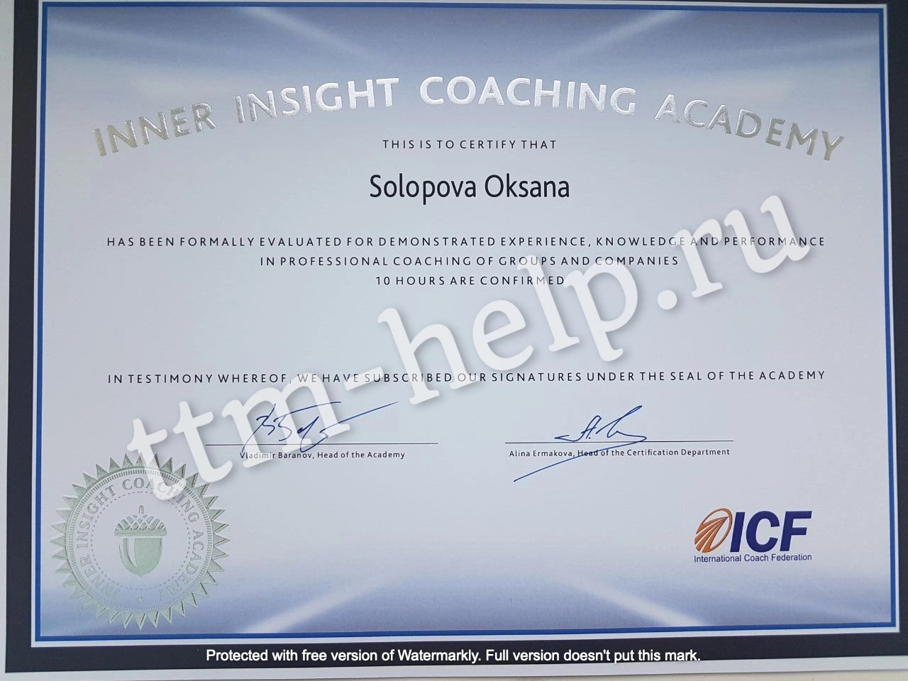
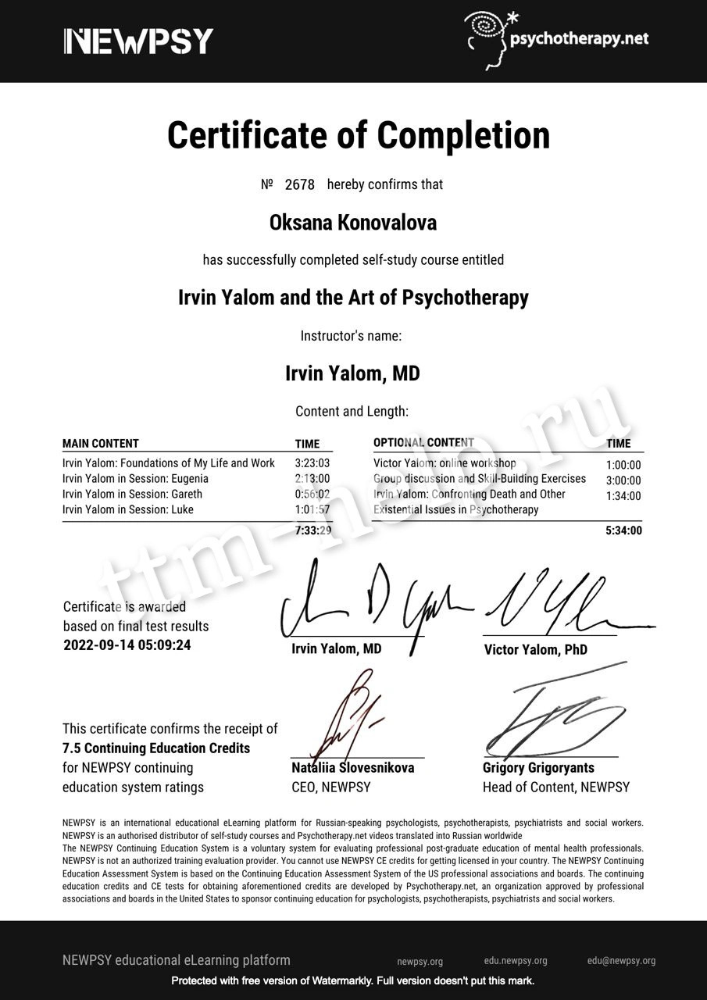
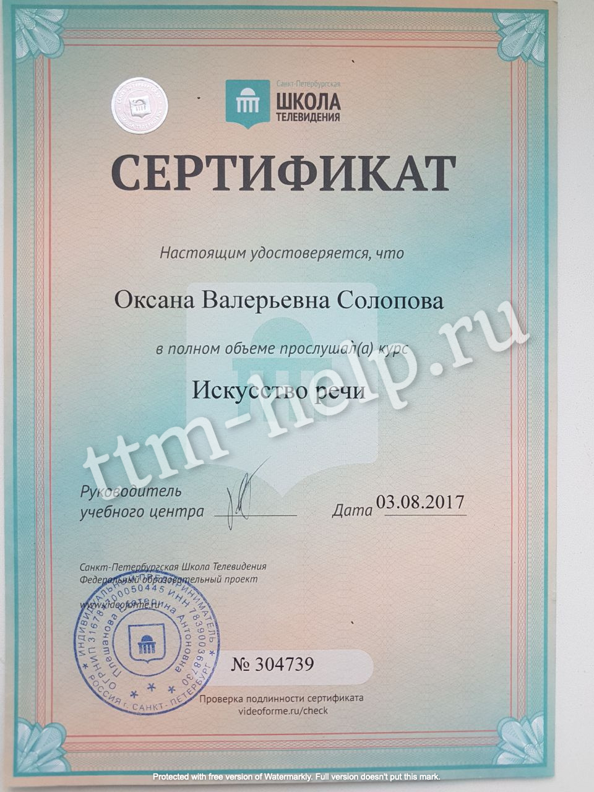
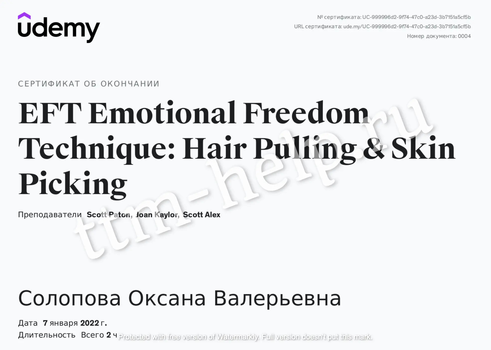
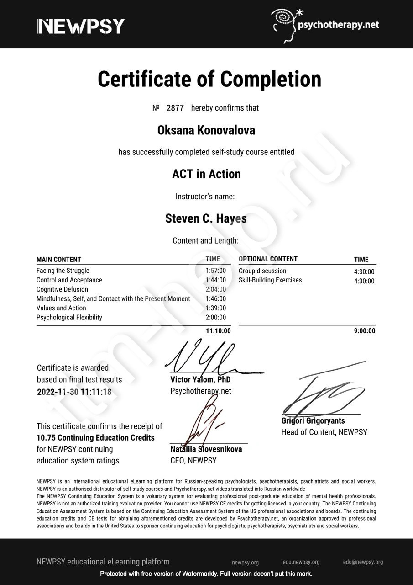
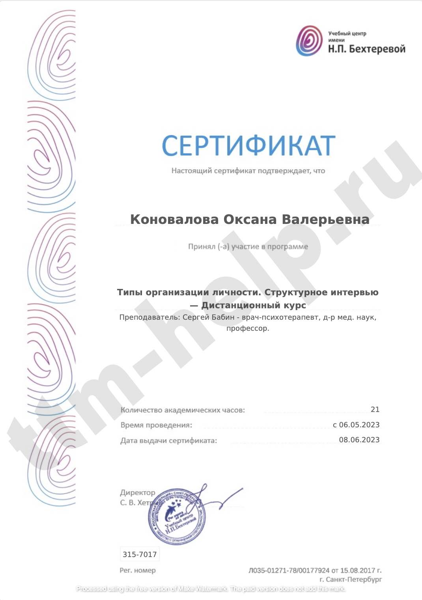

## Обо мне

<picture class="ml-sm-3 mb-sm-3 mt-sm-0">
    <source media="(min-width:720px)"
            width="1200" height="1524"
            srcset="/assets/images/illustrations/about-photo-1.jpg">
    " width="1000" height="739"
         title="{{ site.description }}"
         style="width:50%; min-width: 300px">
</picture>
{% assign age = 'now' | date: "%Y" | minus:1987 %}

Добро пожаловать на мой сайт, посвященный трихотилломании!  

Меня зовут **Оксана**, мне {{ age }} лет, я психотерапевт (основное направление КПТ), работаю с 2012 года.  

Работа с людьми, страдающими трихотилломанией (ТТМ) является моим специальным проектом по нескольким причинам:
- среди русскоговорящего населения достаточно мало психотерапевтов, специализирующихся на работе с данным расстройством;
- я знаю, как решить вопрос с ТТМ у моих пациентов.

На моем сайте вы сможете найти информацию по следующим направлениям:
- Самодиагностика,
- Тревожность,
- Трихотилломания у детей,
- Профилактика рецидивов,
- Причины развития ттм,
- Лечение трихотилломании   

## Что я предлагаю:

- <a href="https://t.me/ttm_help_ru" rel="nofollow">Канал ТТМ в телеграм</a>, где я размещаю статьи, переводы выступлений зарубежных коллег
  в области ТТМ и разные полезные материалы,
- [Диагностическая консультация](/contact.html), где вы заполняете подробную анкету о своем заболевании, мы общаемся более
  подробно на сессии, и я даю список рекомендаций по лечению ТТМ конкретно у вас,
- [Индивидуальная психотерапия](/contact.html), где мы идем по 4 направлениям - информативная часть
  (клиент знакомится с тем, что такое ТТМ, её истоки в его конкретном случае, инструменты замены ТТМ внешние,
  проработка внутренних причин ТТМ, профилактика рецидивов),

Начало любой терапии предваряется диагностической консультацией, где мы знакомимся и намечаем план лечения.

## Мои публикации:
- Коновалова О.В. Трихотилломания: // Вестник Трихологии - интернет журнал союза трихологов. 2023. 
  URL: <a href="http://www.trichology.pro/articles/vracham-spetsialistam/ttm.php" rel="nofollow">http://www.trichology.pro/articles/vracham-spetsialistam/ttm.php</a>.

## Опыт работы:

С 2012 год - корпоративный психолог.  
С 2016 года - интеллект психолог (работа с детьми и взрослыми); преподавание.  
С 2018 года - индивидуальная терапия, консультирование, коучинг.

## Образование:

Юридический психолог (ФГБОУ ВПО СГЮА).  
Когнитивно-поведенческая психотерапия (АНО ДПО АПС).  
Психологическое консультирование родителей (ФГБНУ ПИРАО).  
Библиотерапия в работе с детьми (ФГБНУ ПИРАО).  
Professional Coach (IICA ICF ICF).  
Professional coaching of groups and companies (IICA ICF ICF).  
НЛП-практик.  
EFT Emotional Freedom Technique: Hair Pulling & Skin Picking  
Irvin Yalom and the Art of Psychotherapy (Newpsy education)  
ACT in Action by Steven C.Hayes (Newpsy education)  

    

        
    

    

        
    

    

        
    

    

        
    

    

        
    

    

        
    

    

        
    

    

        
    

    

        
    

    

        
    

