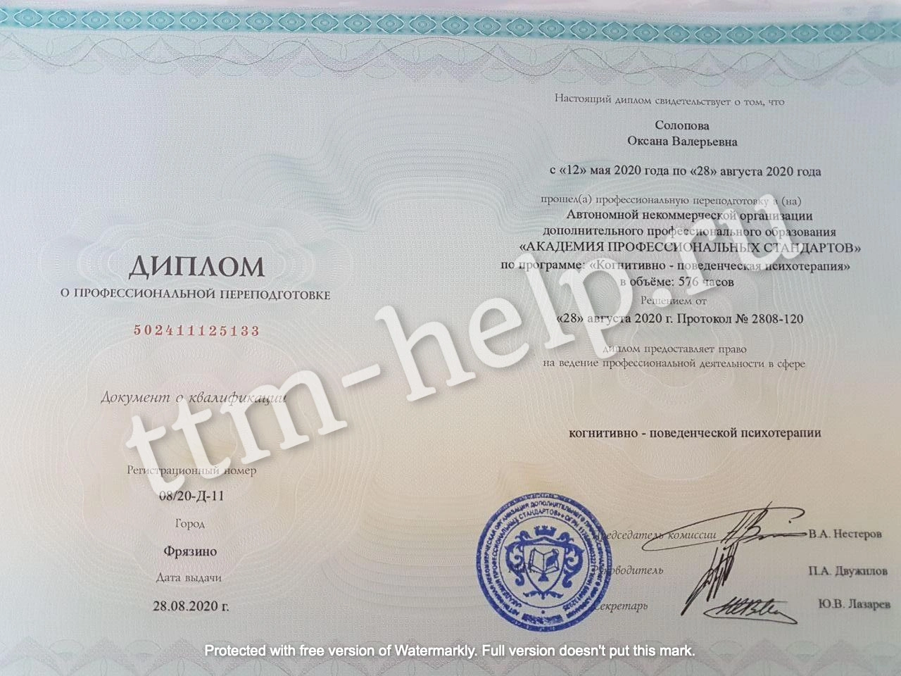
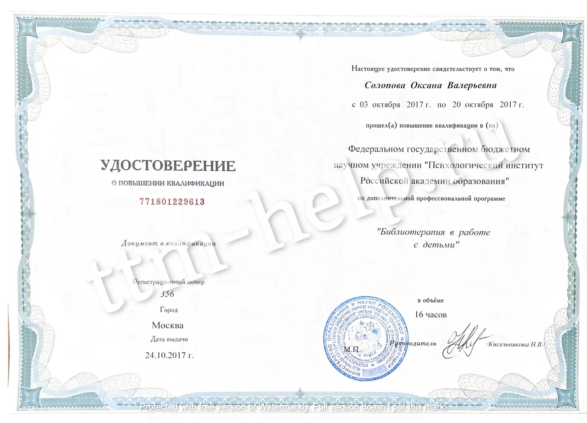
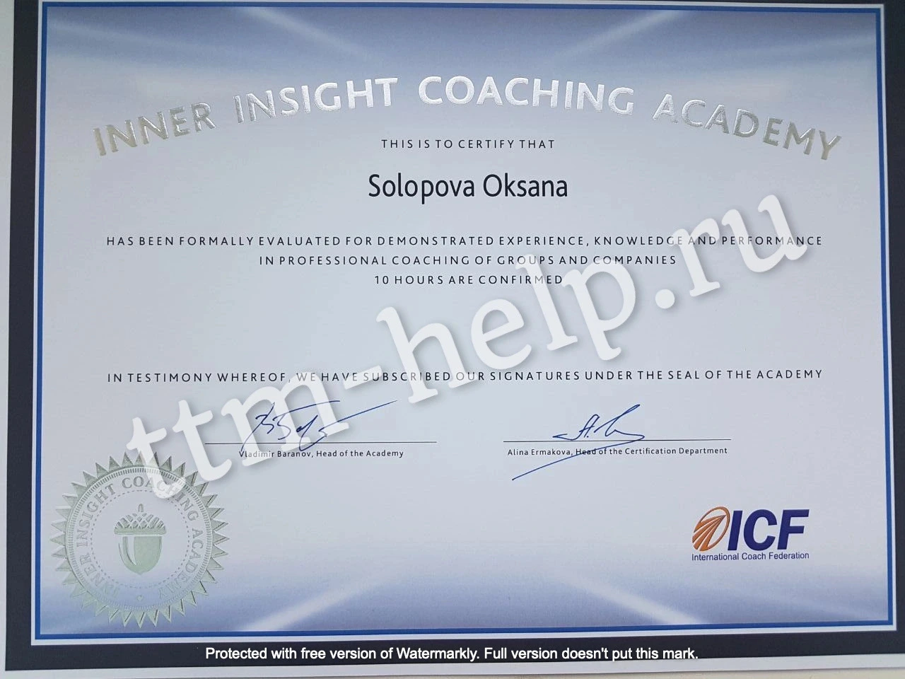
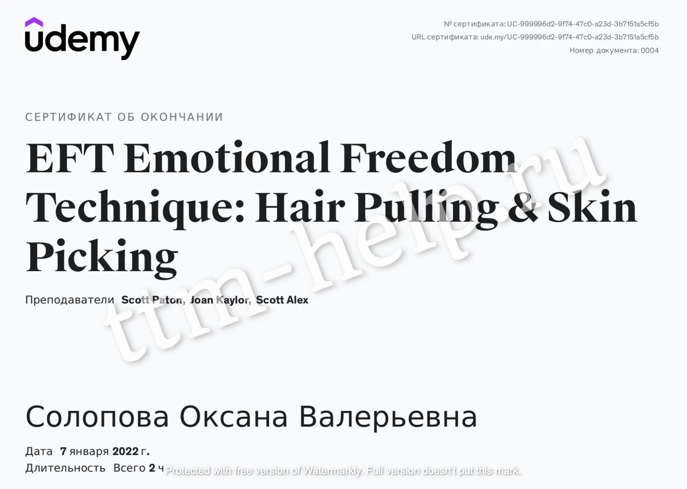
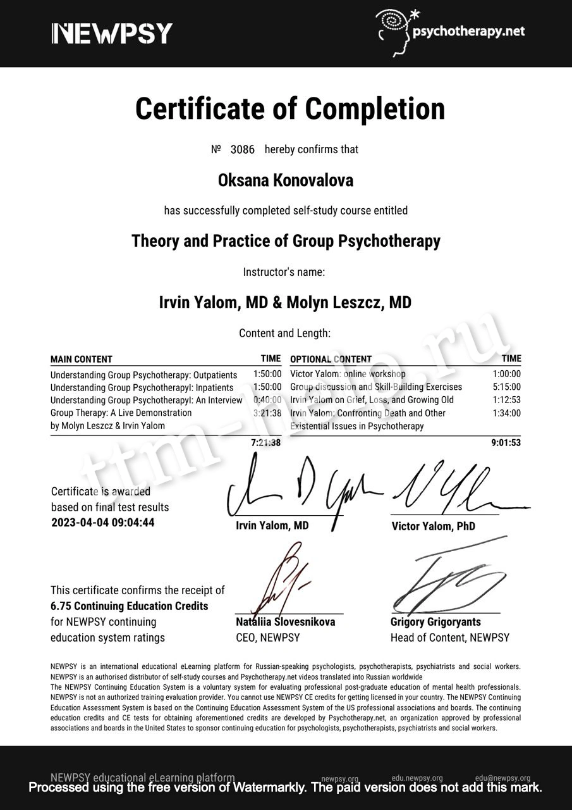

## Обо мне

Добро пожаловать на мой сайт, посвященный трихотилломании!  

Меня зовут Оксана, мне 35 лет, я психотерапевт (основное направление КПТ), работаю с 2012 года.  

Работа с людьми, страдающими трихотилломанией (ТТМ) является моим специальным проектом по нескольким причинам:
- среди русскоговорящего населения достаточно мало психотерапевтов, специализирующихся на работе с данным расстройством;
- я знаю, как решить вопрос с ТТМ у моих пациентов.  

На моем сайте вы сможете найти информацию по следующим направлениям:
- Самодиагностика  
- Тревожность
- ТТМ у детей
- Профилактика рецидивов
- Причины развития ТТМ
- Лечение ТТМ

## Что я предлагаю:
- [Канал ТТМ в телеграм](https://t.me/ttm_help_ru), где я размещаю статьи, переводы выступлений зарубежных коллег 
  в области ТТМ и разные полезные материалы
- [Психотерапевтическая группа помощи при ТТМ (Чат)](https://t.me/+Iofg2iERjAlmMTQy) в телеграм, где я отвечаю на ваши 
  вопросы, а также раз в месяц собираю всех на онлайн встречу, где мы обсуждаем конкретный случай, тему и т д
- [Диагностическая консультация](/contact), где вы заполняете подробную анкету о своем заболевании, мы общаемся более подробно на сессии, 
  и я даю список рекомендаций по лечению ТТМ конкретно у вас; стоимость для участников канала помощи при ТТМ в телеграм 2 500₽.
- [Индивидуальная психотерапия](/contact), где мы идем по 4 направлениям - информативная часть 
  (клиент знакомится с тем, что такое ТТМ, ее истоки в его конкретном случае, инструменты замены ТТМ внешние, 
  проработка внутренних причин ТТМ, профилактика рецидивов); стоимость 20 000₽ в месяц (из расчета 4 сессии по 5 000₽)
- [Групповая психотерапия](/group-therapy) - обучение недостающим навыкам, доращивание психики до здорового состояния без ТТМ, 
  группа не более 5 человек; стоимость 10 000₽ в месяц (из расчета 4 сессии по 2 500₽)
- [Групповая терапия для детей и подростков](/group-therapy) - обучение эмоциональному интеллекту, навыкам здоровой психики, 
  группа не более 5 человек, обратная связь для родителей; стоимость 12 000₽ в месяц (из расчета 4 сессии по 3 000₽ для детей, 
  плюс обратная связь для родителей)

Начало любой терапии предваряется диагностической консультацией, где мы знакомимся и намечаем план лечения. 

## Опыт работы:
С 2012 год - корпоративный психолог.  
С 2016 года - интеллект психолог (работа с детьми и взрослыми); преподавание.  
С 2018 года - индивидуальная терапия, консультирование, коучинг.

## Образование:   
Юридический психолог (ФГБОУ ВПО СГЮА).  
Когнитивно-поведенческая психотерапия (АНО ДПО АПС).  
Психологическое консультирование родителей (ФГБНУ ПИРАО).  
Библиотерапия в работе с детьми (ФГБНУ ПИРАО).  
Professional Coach (IICA ICF ICF).  
Professional coaching of groups and companies (IICA ICF ICF).  
НЛП-практик.  
EFT Emotional Freedom Technique: Hair Pulling & Skin Picking

<ul class="gallery filter">
    <li>
        
    </li>
    <li>
        
    </li>
    <li>
        
    </li>
    <li>
        
    </li>
    <li>
        
    </li>
    <li>
        
    </li>
    <li>
        
    </li>
    <li>
        
    </li>
    <li>
        
    </li>
</ul>
