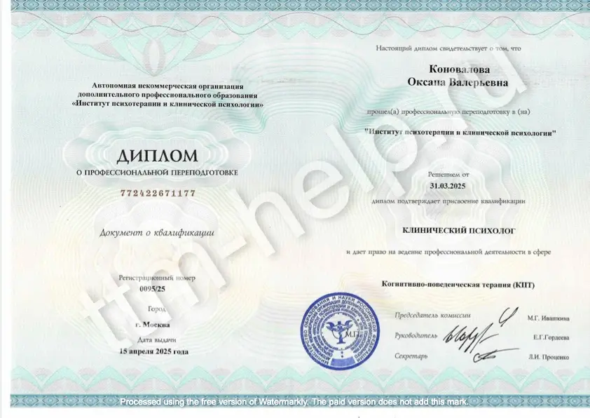

## Обо мне

<picture class="ml-sm-3 mb-sm-3 mt-sm-0">
    <source media="(min-width:720px)"
            width="1008" height="1280"
            srcset="/assets/images/illustrations/about-photo.webp">
    " width="1000" height="739"
         title="{{ site.description }}"
         style="width:50%; min-width: 300px">
</picture>

Добро пожаловать на мой сайт, посвященный трихотилломании!  

Меня зовут **Оксана**, мне 35 лет, я психотерапевт (основное направление КПТ), работаю с 2012 года.  

Работа с людьми, страдающими трихотилломанией (ТТМ) является моим специальным проектом по нескольким причинам:
- среди русскоговорящего населения достаточно мало психотерапевтов, специализирующихся на работе с данным расстройством;
- я знаю, как решить вопрос с ТТМ у моих пациентов.

На моем сайте вы сможете найти информацию по следующим направлениям:

- Самодиагностика
- Тревожность
- ТТМ у детей
- Профилактика рецидивов
- Причины развития ТТМ
- Лечение ТТМ

## Что я предлагаю:

- <a href="https://t.me/ttm_help_ru" rel="nofollow">Канал ТТМ в телеграм</a>, где я размещаю статьи, переводы выступлений зарубежных коллег
  в области ТТМ и разные полезные материалы
- <a href="https://t.me/+Iofg2iERjAlmMTQy" rel="nofollow">Психотерапевтическая группа помощи при ТТМ (Чат)</a> в телеграм, где я отвечаю на ваши
  вопросы, а также раз в месяц собираю всех на онлайн встречу, где мы обсуждаем конкретный случай, тему и т д
- [Диагностическая консультация](/contact.html), где вы заполняете подробную анкету о своем заболевании, мы общаемся более
  подробно на сессии,
  и я даю список рекомендаций по лечению ТТМ конкретно у вас; стоимость для участников канала помощи при ТТМ в телеграм
  2 500₽ за один час.
- [Индивидуальная психотерапия](/contact.html), где мы идем по 4 направлениям - информативная часть
  (клиент знакомится с тем, что такое ТТМ, ее истоки в его конкретном случае, инструменты замены ТТМ внешние,
  проработка внутренних причин ТТМ, профилактика рецидивов); стоимость 20 000₽ в месяц (из расчета 4 сессии по 5 000₽)
- [Групповая психотерапия](/group-therapy.html) - обучение недостающим навыкам, доращивание психики до здорового состояния
  без ТТМ,
  группа не более 5 человек; стоимость 10 000₽ в месяц (из расчета 4 сессии по 2 500₽)
- [Групповая терапия для детей и подростков](/group-therapy.html) - обучение эмоциональному интеллекту, навыкам здоровой
  психики,
  группа не более 5 человек, обратная связь для родителей; стоимость 12 000₽ в месяц (из расчета 4 сессии по 3 000₽ для
  детей,
  плюс обратная связь для родителей)

Начало любой терапии предваряется диагностической консультацией, где мы знакомимся и намечаем план лечения.

## Опыт работы:

С 2012 год - корпоративный психолог.  
С 2016 года - интеллект психолог (работа с детьми и взрослыми); преподавание.  
С 2018 года - индивидуальная терапия, консультирование, коучинг.

## Образование:

Юридический психолог (ФГБОУ ВПО СГЮА).  
Когнитивно-поведенческая психотерапия (АНО ДПО АПС).  
Психологическое консультирование родителей (ФГБНУ ПИРАО).  
Библиотерапия в работе с детьми (ФГБНУ ПИРАО).  
Professional Coach (IICA ICF ICF).  
Professional coaching of groups and companies (IICA ICF ICF).  
НЛП-практик.  
EFT Emotional Freedom Technique: Hair Pulling & Skin Picking  
Irvin Yalom and the Art of Psychotherapy (Newpsy education)  
ACT in Action by Steven C.Hayes (Newpsy education)  

<ul class="gallery filter">
    <li>
        
    </li>
    <li>
        
    </li>
    <li>
        
    </li>
    <li>
        
    </li>
    <li>
        
    </li>
    <li>
        
    </li>
    <li>
        
    </li>
    <li>
        
    </li>
    <li>
        
    </li>
</ul>
